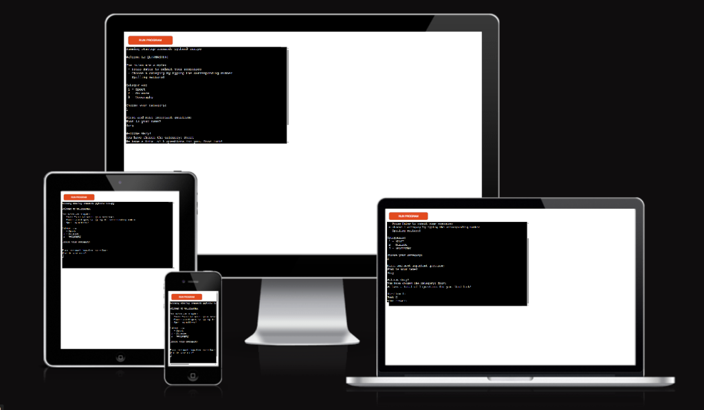
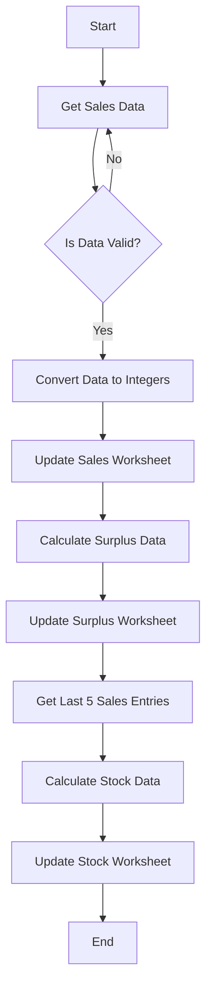

# [Quizmaster](https://quizmaster-game-dfe6a1b8c370.herokuapp.com)

Developer: Gary Burke ([Gary-Burke](https://www.github.com/Gary-Burke))

[](https://www.github.com/Gary-Burke/quizmaster/commits/main)
[](https://www.github.com/Gary-Burke/quizmaster/commits/main)
[](https://www.github.com/Gary-Burke/quizmaster)
[](https://quizmaster-game-dfe6a1b8c370.herokuapp.com)

## Introduction ##

Quizmaster is a fun and inter-active general knowledge game to be played by individuals.
The main goal of the app, is to test a player's knowledge in a certain field or category and at the same time, expand their knowledge in that specific field.
Since this is a Command Line interface, I opted for an app where graphics and visual ques are not needed. Playing and learning at the same time makes quiz games fun and exciting, that is why I chose to develop Quizmaster.




## UX

### The 5 Planes of UX

⚠️ NOTE: make sure to update the text below to match your own project! ⚠️

#### 1. Strategy

**Purpose**
- Provide users with a simple and effective way to track daily sandwich sales and analyze trends over time.
- Help users optimize sandwich production to reduce waste and meet demand efficiently.

**Primary User Needs**
- Track daily sales by sandwich type with minimal effort.
- Analyze sales data for trends and insights.
- Receive suggestions for future sandwich production.

**Business Goals**
- Offer a reliable tool for tracking sales and optimizing inventory.
- Help businesses reduce waste and improve customer satisfaction through better forecasting.

#### 2. Scope

**[Features](#features)** (see below)

**Content Requirements**
- Input form for daily sandwich sales.
- Display of total daily sales and breakdown by sandwich type.
- Trend analysis over specified time periods (e.g., week, month).
- Category filters for sandwich types (e.g., vegetarian, meat, cheese).
- Suggested production numbers for the next day based on sales data.

#### 3. Structure

**Information Architecture**
- **Hierarchy**:
  - Daily sales input form as the primary focus for ease of use.

**User Flow**
1. User opens the app → inputs daily sandwich sales data.
2. User views a summary of the day’s sales → checks breakdown by type.
3. User views Trends → analyzes sales trends over time.
4. User receives suggested production numbers for the next day.
5. User logs data quickly and returns to shop activities.

#### 4. Skeleton

**[Wireframes](#wireframes)** (see below)

#### 5. Surface

**Visual Design Elements**
- **[Colours](#colour-scheme)** (see below)
- **[Typography](#typography)** (see below)

## Wireframes

To follow best practice, a flowchart was created to showcase the progression of the Python app.
I've used [Lucidchart](https://www.lucidchart.com/pages/examples/flowchart-maker) to design my app flowchart.


## User Stories

| Target | Expectation | Outcome |
| --- | --- | --- |
| As a user | it would be good to see a clear and concise landing page | so that I know what the game is about. |
| As a user | I want to see the rules clearly seperated from the welcome message | and kept short and direct. |
| As a user | it would be exciting if I could choose different categories | with which to play the quiz game. |
| As a user | it would be good to know how many questions there are in the selected quiz | so as to know the length of the game. |
| As a user | my input needs to be validated and a clear error message needs to be displayed when my input is invalid |  so as to ensure a proper and smooth gaming experience. |
| As a user |  I want to get feedback on my answers, whether they are right or wrong | and if wrong, I want to know what the actual correct answer is. |
| As a user |  I would like to be able to submit my name in the game | to get a personalized feedback when the game is over. |

## Features

⚠️ INSTRUCTIONS ⚠️

In this section, you should go over the different parts of your project, and describe each feature. You should explain what value each of the features provides for the user, focusing on your target audience, what they want to achieve, and how your project can help them achieve these things.

**IMPORTANT**: Remember to always include a screenshot of each individual feature!

⚠️ --- END --- ⚠️

### Existing Features

| Feature | Notes | Screenshot |
| --- | --- | --- |
| Data Input Validation | The program validates user input by ensuring the data is exactly six comma-separated numbers before continuing. |  |
| API Update | Sales, surplus, and stock data are updated in the relevant Google Sheets worksheet using gspread functionality. |  |
| Surplus Calculation | Calculates surplus by comparing the latest stock and sales data to identify potential waste or shortages. |  |
| Last 5 Sales Entries | Retrieves the last five sales entries from the "sales" worksheet for calculating stock averages. |  |
| Stock Calculation | Computes stock based on the last 5 sales entries, adding 10% to the average to ensure adequate future stock. |  |
| Sales Data Automation | Automates the entire process of retrieving, validating, and updating sales, surplus, and stock data in Google Sheets. |  |

### Future Features

⚠️ INSTRUCTIONS ⚠️

Do you have additional ideas that you'd like to include on your project in the future? Fantastic, list them here! It's always great to have plans for future improvements. Consider adding any helpful links or notes to help remind you in the future, if you revisit the project in a couple years.

A few examples are listed below to align with possible ways to improve on the sample walkthrough project, to give you some inspiration.

⚠️ --- END ---⚠️

- **User Authentication and Role Management**: Implement a login system with roles (e.g., admin, employee) to restrict data access based on user roles.
- **Data Visualization**: Add charts and graphs to visually represent sales trends, stock levels, and surplus/waste over time.
- **Real-time Data Sync**: Integrate real-time syncing of sales and stock data across multiple devices to support live updates.
- **Automated Restocking Alerts**: Notify users when stock levels fall below a certain threshold, prompting restock orders.
- **Predictive Analytics**: Use historical sales data to predict future demand, helping to optimize stock levels and minimize waste.
- **Multilingual Support**: Add support for multiple languages to make the app more accessible to a global audience.
- **Mobile App Integration**: Develop a mobile version of the app for easier data input and stock management on the go.
- **Reporting and Exporting**: Generate and export detailed reports in PDF or CSV format for deeper analysis of sales, surplus, and stock data.
- **Inventory Management**: Include functionality to track supplier information, order inventory, and manage costs directly within the app.
- **Customer Feedback Integration**: Allow customers to leave feedback on sold items, giving insight into sales performance and customer satisfaction.
- **Customizable Dashboards**: Provide users with the ability to customize their dashboard, selecting which data points and metrics they want to monitor.
- **Historical Data Comparison**: Implement functionality to compare current sales and stock data with data from the same period in previous years.
- **Seasonal Adjustment Recommendations**: Analyze sales patterns and suggest stock adjustments for holidays or other seasonal trends.
- **API Integration**: Provide an API for integrating with other third-party services, such as point-of-sale systems or accounting software.

## Tools & Technologies

| Tool / Tech | Use |
| --- | --- |
| [](https://markdown.2bn.dev) | Generate README and TESTING templates. |
| [](https://git-scm.com) | Version control. (`git add`, `git commit`, `git push`) |
| [](https://github.com) | Secure online code storage. |
| [](https://code.visualstudio.com) | Local IDE for development. |
| [](https://www.python.org) | Back-end programming language. |
| [](https://www.heroku.com) | Hosting the deployed back-end site. |
| [](https://docs.google.com/spreadsheets) | Storing data from my Python app. |
| [](https://chat.openai.com) | Help debug, troubleshoot, and explain things. |
| [](https://www.lucidchart.com) | Flow diagrams for mapping the app's logic. |
| [](https://www.w3schools.com) | Tutorials/Reference Guide |
| [](https://stackoverflow.com) | Troubleshooting and Debugging |

⚠️ NOTE ⚠️

Want to add more?

- Tutorial: https://shields.io/badges/static-badge
- Icons/Logos: https://simpleicons.org
  - FYI: not all logos are available to use

🛑 --- END --- 🛑

## Database Design

### Data Model

#### Flowchart

To follow best practice, a flowchart was created for the app's logic, and mapped out using a free version of [Lucidchart](https://www.lucidchart.com/pages/ER-diagram-symbols-and-meaning) and/or [Draw.io](https://www.draw.io). The flowchart below represents the main process of this Python program. It shows the entire cycle of the application.


⚠️ RECOMMENDED ⚠️

Looking for an interactive version of your flowchart? Consider using a [`Mermaid flowchart`](https://mermaid.live). To simplify the process, you can ask ChatGPT (or similar) the following prompt:

> ChatGPT Prompt:  
> "Generate a Markdown syntax Mermaid flowchart using a screenshot of my existing flowchart"  
> [paste-your-flowchart-screenshot-into-ChatGPT]

The "Love Sandwiches" sample flowchart in Markdown syntax using Mermaid can be seen below as an example.

**NOTE**: A Markdown Preview tool doesn't show the interactive flowchart, you must first commit/push the code to your GitHub repository in order to see it live in action.



Source: [Mermaid Flowchart for Love Sandwiches](https://mermaid.live/edit#pako:eNpdkctugzAQRX_F8jpZdsOiVXkkIa26SR9qgcUIJoAwNjLjVlXIv5cMJErjlWfu8b0z8kHmpkDpyb0yP3kFlsRrmGoxnsdkR2OdieXyXvjJGknsQGEvQiDIJsZnMTjEU1e8g6qLh-MkBidx-MR-EGESGP2NoztjZESsCUu0fXbNvphB-FMjZOcoeesKIJyTP4xt-gqR5lcRQ6skAJU7xZyznXL_ZlwxtL44zcSt15qxDe_5DD2Juzk00mRrPA-6YSy-jiSTN9eBMSPbSyDrt3Fbhp6SSBeZXMgWbQt1MX7E4aSnkipsMZXeeC3ANqlM9XHkwJHZ_epcemQdLqTjjLCG0kJ7bnagv4y5lNa4spLeHlSPxz-Rd5za)

⚠️ --- END --- ⚠️

#### Classes & Functions

⚠️ INSTRUCTIONS ⚠️

Use this space to explain your Python classes (if applicable) and functions. Examples below for inspiration, although Love Sandwiches doesn't use this example `Person` class/object.

⚠️ --- END --- ⚠️

The program uses classes as a blueprint for the project's object-oriented programming (OOP). This allows for the object to be reusable and callable where necessary.

```python
class Person:
    """ Insert docstring comments here """
    def __init__(self, name, age, health, inventory):
        self.name = name
        self.age = age
        self.health = health
        self.inventory = inventory
```

The primary functions used on this application are:

- `get_sales_data()`
    - Get sales figures input from the user.
- `validate_data()`
    - Converts all string values into integers.
- `update_worksheet()`
    - Update the relevant worksheet with the data provided.
- `calculate_surplus_data()`
    - Compare sales with stock and calculate the surplus for each item type.
- `get_last_5_entries_sales()`
    - Collects columns of data from sales worksheet.
- `calculate_stock_data()`
    -  Calculate the average stock for each item type, adding 10%.
- `main()`
    - Run all program functions.

#### Imports

⚠️ INSTRUCTIONS ⚠️

Use this space to explain your Python imports and packages, with some common examples found below.

⚠️ --- END --- ⚠️

I've used the following Python packages and external imports.

- `gspread`: used with the Google Sheets API
- `google.oauth2.service_account`: used for the Google Sheets API credentials
- `time`: used for adding time delays
- `os`: used for adding a `clear()` function
- `colorama`: used for including color in the terminal
- `random`: used to get a random choice from a list

## Agile Development Process

### GitHub Projects

⚠️ TIP ⚠️

Consider adding screenshots of your Projects Board(s), Issues (open and closed), and Milestone tasks.

⚠️ --- END ---⚠️

[GitHub Projects](https://www.github.com/Gary-Burke/quizmaster/projects) served as an Agile tool for this project. Through it, EPICs, User Stories, issues/bugs, and Milestone tasks were planned, then subsequently tracked on a regular basis using the Kanban project board.


### GitHub Issues

[GitHub Issues](https://www.github.com/Gary-Burke/quizmaster/issues) served as an another Agile tool. There, I managed my User Stories and Milestone tasks, and tracked any issues/bugs.

| Link | Screenshot |
| --- | --- |
| [](https://www.github.com/Gary-Burke/quizmaster/issues?q=is%3Aissue%20is%3Aopen%20-label%3Abug) |  |
| [](https://www.github.com/Gary-Burke/quizmaster/issues?q=is%3Aissue%20is%3Aclosed%20-label%3Abug) |  |

### MoSCoW Prioritization

I've decomposed my Epics into User Stories for prioritizing and implementing them. Using this approach, I was able to apply "MoSCoW" prioritization and labels to my User Stories within the Issues tab.

- **Must Have**: guaranteed to be delivered - required to Pass the project (*max ~60% of stories*)
- **Should Have**: adds significant value, but not vital (*~20% of stories*)
- **Could Have**: has small impact if left out (*the rest ~20% of stories*)
- **Won't Have**: not a priority for this iteration - future features

## Testing

> [!NOTE]  
> For all testing, please refer to the [TESTING.md](TESTING.md) file.

## Deployment

Code Institute has provided a [template](https://github.com/Code-Institute-Org/python-essentials-template) to display the terminal view of this backend application in a modern web browser. This is to improve the accessibility of the project to others.

The live deployed application can be found deployed on [Heroku](https://quizmaster-game-dfe6a1b8c370.herokuapp.com).

### Heroku Deployment

This project uses [Heroku](https://www.heroku.com), a platform as a service (PaaS) that enables developers to build, run, and operate applications entirely in the cloud.

Deployment steps are as follows, after account setup:

- Select **New** in the top-right corner of your Heroku Dashboard, and select **Create new app** from the dropdown menu.
- Your app name must be unique, and then choose a region closest to you (EU or USA), then finally, click **Create App**.
- From the new app **Settings**, click **Reveal Config Vars**, and set the value of **KEY** to `PORT`, and the **VALUE** to `8000` then select **ADD**.
- If using any confidential credentials, such as **CREDS.JSON**, then these should be pasted in the Config Variables as well.
- Further down, to support dependencies, select **Add Buildpack**.
- The order of the buildpacks is important; select `Python` first, then `Node.js` second. (if they are not in this order, you can drag them to rearrange them)

Heroku needs some additional files in order to deploy properly.

- [requirements.txt](requirements.txt)
- [Procfile](Procfile)
- [.python-version](.python-version)

You can install this project's **[requirements.txt](requirements.txt)** (*where applicable*) using:

- `pip3 install -r requirements.txt`

If you have your own packages that have been installed, then the requirements file needs updated using:

- `pip3 freeze --local > requirements.txt`

The **[Procfile](Procfile)** can be created with the following command:

- `echo web: node index.js > Procfile`

The **[.python-version](.python-version)** file tells Heroku the specific version of Python to use when running your application.

- `3.12` (or similar)

For Heroku deployment, follow these steps to connect your own GitHub repository to the newly created app:

Either (*recommended*):

- Select **Automatic Deployment** from the Heroku app.

Or:

- In the Terminal/CLI, connect to Heroku using this command: `heroku login -i`
- Set the remote for Heroku: `heroku git:remote -a app_name` (*replace `app_name` with your app name*)
- After performing the standard Git `add`, `commit`, and `push` to GitHub, you can now type:
	- `git push heroku main`

The Python terminal window should now be connected and deployed to Heroku!

### Google Sheets API

This application uses [Google Sheets](https://docs.google.com/spreadsheets) to handle a "makeshift" database on the live site.

⚠️ INSTRUCTIONS ⚠️

The sample Sheet below follows along with the CI Love Sandwiches lessons, so make sure to refactor to your own project requirements.

⚠️ --- END ---⚠️

To run your own version of this application, you will need to create your own Google Sheet with three sheets named `sales`, `surplus`, and `stock` in the following format:

| cheese ham | tom moz | chicken salad | egg salad | hummus veg | ham egg |
| --- | --- | --- | --- | --- | --- |
| sample data | sample data | sample data | sample data | sample data | sample data |
| sample data | sample data | sample data | sample data | sample data | sample data |
| sample data | sample data | sample data | sample data | sample data | sample data |

A credentials file in `.JSON` format from the Google Cloud Platform is also mandatory:

[Google Cloud Platform](https://console.cloud.google.com)

1. From the dashboard click on "Select a project", and then the **NEW PROJECT** button.
2. Give the project a name, and then click **CREATE**.
3. Click **SELECT PROJECT** to get to the project page.
4. From the side-menu, select "APIs & Services", then select "Library".
5. Search for the "Google Drive API", select it, and then click on **ENABLE**.
6. Click on the **CREATE CREDENTIALS** button.
7. From the "Which API are you using?" dropdown menu, choose **Google Drive API**.
8. For the "What data will you be accessing?" question, select **Application Data**.
9. Click **Next**.
10. Enter a "Service Account" name, then click **Create**.
11. In the "Role" dropdown box, choose "Basic" > "Editor", then press **Continue**.
12. "Grant users access to this service account" can be left blank. Click **DONE**.
13. On the next page, click on the "Service Account" that has been created.
14. On the next page, click on the "Keys" tab.
15. Click on the "Add Key" dropdown, and select "Create New Key".
16. Select `JSON`, and then click **Create**. This will trigger the `.json` file with your API credentials in it to download to your machine locally.
17. For local deployment, this needs to be renamed to `creds.json`.
18. Repeat steps 4 & 5 above to add the "Google Sheets API".
19. Copy the `client_email` that is in the `creds.json` file.
20. Share your Google Sheet to the `client_email`, ensuring "Editing" is enabled.
21. Add the `creds.json` file to your `.gitignore` file, so as not to push your credentials to GitHub publicly.


### Local Development

This project can be cloned or forked in order to make a local copy on your own system.

For either method, you will need to install any applicable packages found within the [requirements.txt](requirements.txt) file.

- `pip3 install -r requirements.txt`.

If using any confidential credentials, such as `CREDS.json` or `env.py` data, these will need to be manually added to your own newly created project as well.

#### Cloning

You can clone the repository by following these steps:

1. Go to the [GitHub repository](https://www.github.com/Gary-Burke/quizmaster).
2. Locate and click on the green "Code" button at the very top, above the commits and files.
3. Select whether you prefer to clone using "HTTPS", "SSH", or "GitHub CLI", and click the "copy" button to copy the URL to your clipboard.
4. Open "Git Bash" or "Terminal".
5. Change the current working directory to the location where you want the cloned directory.
6. In your IDE Terminal, type the following command to clone the repository:
	- `git clone https://www.github.com/Gary-Burke/quizmaster.git`
7. Press "Enter" to create your local clone.

Alternatively, if using Ona (formerly Gitpod), you can click below to create your own workspace using this repository.

[](https://gitpod.io/#https://www.github.com/Gary-Burke/quizmaster)

**Please Note**: in order to directly open the project in Ona (Gitpod), you should have the browser extension installed. A tutorial on how to do that can be found [here](https://www.gitpod.io/docs/configure/user-settings/browser-extension).

#### Forking

By forking the GitHub Repository, you make a copy of the original repository on our GitHub account to view and/or make changes without affecting the original owner's repository. You can fork this repository by using the following steps:

1. Log in to GitHub and locate the [GitHub Repository](https://www.github.com/Gary-Burke/quizmaster).
2. At the top of the Repository, just below the "Settings" button on the menu, locate and click the "Fork" Button.
3. Once clicked, you should now have a copy of the original repository in your own GitHub account!

### Local VS Deployment

⚠️ INSTRUCTIONS ⚠️

Use this space to discuss any differences between the local version you've developed, and the live deployment site. Generally, there shouldn't be [m]any major differences, so if you honestly cannot find any differences, feel free to use the following example:

⚠️ --- END --- ⚠️

There are no remaining major differences between the local version when compared to the deployed version online.

## Credits

⚠️ INSTRUCTIONS ⚠️

In the following sections, you need to reference where you got your content, media, and any extra help. It is common practice to use code from other repositories and tutorials (which is totally acceptable), however, it is important to be very specific about these sources to avoid potential plagiarism.

⚠️ --- END ---⚠️

### Content

⚠️ INSTRUCTIONS ⚠️

Use this space to provide attribution links for any borrowed code snippets, elements, and resources. Ideally, you should provide an actual link to every resource used, not just a generic link to the main site. If you've used multiple components from the same source (such as Bootstrap), then you only need to list it once, but if it's multiple Codepen samples, then you should list each example individually. If you've used AI for some assistance (such as ChatGPT or Perplexity), be sure to mention that as well. A few examples have been provided below to give you some ideas.

Eventually you'll want to learn how to use Git branches. Here's a helpful tutorial called [Learn Git Branching](https://learngitbranching.js.org) to bookmark for later.

⚠️ --- END ---⚠️

| Source | Notes |
| --- | --- |
| [Markdown Builder](https://markdown.2bn.dev) | Help generating Markdown files |
| [Chris Beams](https://chris.beams.io/posts/git-commit) | "How to Write a Git Commit Message" |
| [Love Sandwiches](https://codeinstitute.net) | Code Institute walkthrough project inspiration |
| [Real Python](https://realpython.com/python-quiz-application) | Inspiration for a quiz app |
| [BroCode](https://www.youtube.com/watch?v=ag8NtD1e0Kc) | Inspiration for hangman game |
| [Python Tutor](https://pythontutor.com) | Additional Python help |
| [Colorama](https://www.youtube.com/watch?v=u51Zjlnui4Y) | Adding color in Python |
| [StackOverflow](https://stackoverflow.com/a/50921841) | Clear screen in Python |
| [ChatGPT](https://chatgpt.com) | Help with code logic and explanations |

### Media

⚠️ INSTRUCTIONS ⚠️

Use this space to provide attribution links to any media files borrowed from elsewhere (images, videos, audio, etc.). If you're the owner (or a close acquaintance) of some/all media files, then make sure to specify this information. Let the assessors know that you have explicit rights to use the media files within your project. Ideally, you should provide an actual link to every media file used, not just a generic link to the main site, unless it's AI-generated artwork.

Looking for some media files? Here are some popular sites to use. The list of examples below is by no means exhaustive.

- Images
    - [Pexels](https://www.pexels.com)
    - [Unsplash](https://unsplash.com)
    - [Pixabay](https://pixabay.com)
    - [Lorem Picsum](https://picsum.photos) (placeholder images)
    - [Wallhere](https://wallhere.com) (wallpaper / backgrounds)
    - [This Person Does Not Exist](https://thispersondoesnotexist.com) (reload to get a new person)
- Audio
    - [Audio Micro](https://www.audiomicro.com/free-sound-effects)
    - [Button Clicks](https://www.zapsplat.com/sound-effect-category/button-clicks)
    - [Lasers & Weapons](https://www.zapsplat.com/sound-effect-category/lasers-and-weapons/page/5)
    - [Puzzle Music](https://soundimage.org/puzzle-music)
    - [Camtasia Audio](https://library.techsmith.com/camtasia/assets/Audio)
- Video
    - [Videvo](https://www.videvo.net)
- Image Compression
    - [TinyPNG](https://tinypng.com) (for images <5MB)
    - [CompressPNG](https://compresspng.com) (for images >5MB)

A few examples have been provided below to give you some ideas on how to do your own Media credits.

⚠️ --- END ---⚠️

| Source | Notes |
| --- | --- |
| [ASCII Art Archive](https://www.asciiart.eu) | Pre-defined ASCII art |
| [TEXT-IMAGE](https://www.text-image.com) | Converting an image to ASCII art |
| [Patorjk](https://patorjk.com/software/taag) | Converting text to ASCII art |

### Acknowledgements

⚠️ INSTRUCTIONS ⚠️

Use this space to provide attribution and acknowledgement to any supports that helped, encouraged, or supported you throughout the development stages of this project. It's always lovely to appreciate those that help us grow and improve our developer skills. A few examples have been provided below to give you some ideas.

⚠️ --- END ---⚠️

- I would like to thank my Code Institute mentor, [Tim Nelson](https://www.github.com/TravelTimN) for the support throughout the development of this project.
- I would like to thank the [Code Institute](https://codeinstitute.net) Tutor Team for their assistance with troubleshooting and debugging some project issues.
- I would like to thank the [Code Institute Slack community](https://code-institute-room.slack.com) and [Code Institute Discord community](https://discord-portal.codeinstitute.net) for the moral support; it kept me going during periods of self doubt and impostor syndrome.
- I would like to thank my partner, for believing in me, and allowing me to make this transition into software development.
- I would like to thank my employer, for supporting me in my career development change towards becoming a software developer.

