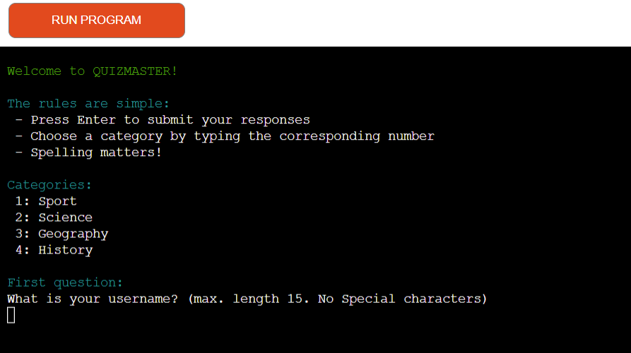
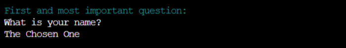
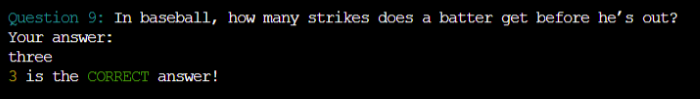
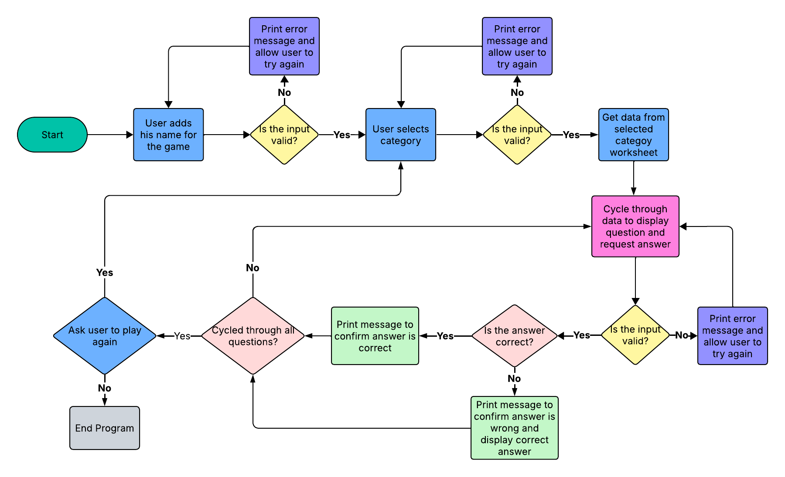
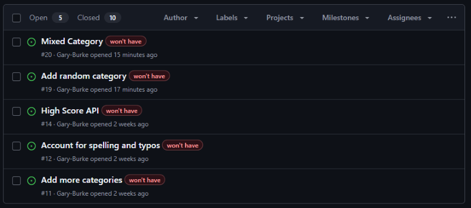
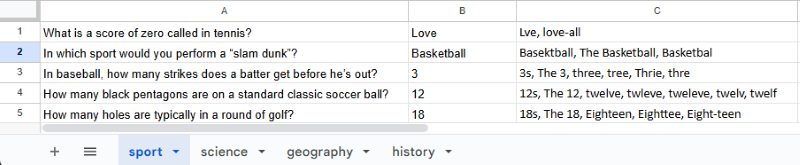

# [Quizmaster](https://quizmaster-game-dfe6a1b8c370.herokuapp.com)

Developer: Gary Burke ([Gary-Burke](https://www.github.com/Gary-Burke))

## Introduction

Introducing Quizmaster – The Ultimate Knowledge Challenge

Quizmaster is an engaging and intellectually stimulating general knowledge game designed for individuals who love to test their minds and learn something new with every play. The app’s primary goal is to challenge players across a variety of categories while helping them expand their understanding in each field.

Built with a clean and efficient command-line interface, Quizmaster delivers a seamless, distraction-free experience where the focus remains on what truly matters — knowledge and fun. Whether you’re a trivia enthusiast or simply looking to sharpen your mind, Quizmaster offers an exciting blend of learning and entertainment that keeps players coming back for more.

Put your knowledge to the test with Quizmaster.

The live deployed application can be viewed here: [Heroku](https://quizmaster-game-dfe6a1b8c370.herokuapp.com)

## UX

### User Stories

| Target | Expectation | Outcome |
| --- | --- | --- |
| As a player | it would be good to see a clear and concise landing page | so that I know what the game is about. |
| As a player | I want to see the rules clearly separated from the welcome message | and kept short and direct. |
| As a player | it would be exciting if I could choose different categories | with which to play the quiz game. |
| As a player | it would be good to know how many questions there are in the selected quiz | so as to know the length of the game. |
| As a player | my input needs to be validated and a clear error message needs to be displayed when my input is invalid |  so as to ensure a proper and smooth gaming experience. |
| As a player | I want to get feedback on my answers, whether they are right or wrong | and if wrong, I want to know what the actual correct answer is. |
| As a player | I would like to be able to submit my name in the game | to get personalized feedback when the game is over. |
| As a player | it would be a good experience to see how many answers I got correct | so that I can challenge myself again next time. |
| As a player | I would like to be able to answer a question with a number or with text,e.g., "2" or "Two" | this would add to the user experience. |
| As a player | I would like to be able to start another round of the quiz at the end of the game | this would add to the user experience and create a natural flow of events. |

### Features

### Existing Features

| Feature | Notes | Screenshot |
| --- | --- | --- |
| Category Selection | The user can choose which category they want to be quizzed on. This makes the game more versatile and fun. |  |
| Add Name | The user gets to add his name for the game. This is used to provide a customized message to the user, making him feel welcomed. |  |
| Welcome Message | The program greets the user by name, confirms the selected category, and displays the number of questions. This gives the user all the information needed as the game is about to start. |  |
| Questions & Feedback | The program informs the player when an answer is correct or incorrect, and if incorrect, provides the actual answer. Although the input is spelling sensitive, it is not case sensitive. This provides a better player experience. |  |
| Questions & Feedback | The program makes provision for answers to be written in both words or numbers, when applicable,e.g., "Two" or "2". Typos and spelling mistakes are accounted for, but this is not extensive. |  |
| Game Over Message | The program informs the player when the quiz has been completed with a customized message, which also provides feedback on how many questions the player got correct. This adds a competitive edge to the game. |  |
| New Game | This feature allows the user to start another round of the game, without having to add their name again. |  |

> [!NOTE]  
> For all data validation features, please refer to the defensive testing in the [TESTING.md](TESTING.md) file.

### Future Features

- **Spelling and typos**: As this game relies on user input, it would be beneficial to add an extensive list of rules or exceptions, to catch spelling mistakes, typos or alternative spellings from the user and account for them.
- **Add more categories**: I would like to expand the game by adding several more categories of question to choose from.
- **High Score API**: It would add value to the game to be able to store and track the high scores for each player and their various categories.

## Tools & Technologies

| Tool / Tech | Use |
| --- | --- |
|  | Generate README and TESTING templates. |
|  | Version control. (`git add`, `git commit`, `git push`) |
|  | Secure online code storage. |
|  | Local IDE for development. |
|  | Back-end programming language. |
|  | Hosting the deployed back-end site. |
|  | Storing data from my Python app. |
|  | Help debug, troubleshoot, and explain things. |
|  | Flow diagrams for mapping the app's logic. |
|  | Tutorials/Reference Guide |
|  | Troubleshooting and Debugging |
|  | Grammar and spell check |

## Database Design

### Data Model

#### Structure

**User Flow**
1. User opens the app → Sees the rules and categories listed.
2. Program asks user for his name → User inputs name into the input field
3. Program asks user to choose a category → User inputs a number to choose the category.
3. Program gets the corresponding worksheet from Google Sheets for the quiz.
4. User sees start game message → The user name, selected category and total number of questions are displayed
5. User sees first question → User supplies answer
6. User gets feedback → Answer was correct or incorrect
7. User gets feedback → If the answer was incorrect, then the correct answer is displayed
8. User sees next question → Game repeats until all questions have been cycled through
9. App informs the user that the game is over and how many answers they got correct.
10. Program asks user if he wants to play again →    
→ No → Program ends game and clears terminal  
→ Yes → Program starts new game

#### Flowchart

To follow best practice, a flowchart was created for the app's logic and mapped out using a free version of [Lucidchart](https://www.lucidchart.com/pages/ER-diagram-symbols-and-meaning). The flowchart below represents the main process of this Python program. It shows the entire cycle of the application.

Mermaid flowchart:

#### Functions

The primary functions used on this application are:

- `print_categories()`
    -  Prints the heading 'Categories:' and lists all of the categories.
- `choose_category()`
    - Ask user to choose a category from a list and validates the data input.
- `get_player_name()`
    - Ask user to supply their name and validates the data input.
- `load_game()`
    - Use the selected category from the user to load the correct worksheet.
- `start_game()`
    - Loops through questions one by one. Gives feedback on the answers from the user. Validates each input.
- `game_over()`
    - Print a game over message to the user, which includes the score count.
- `validate_empty_input()`
    -  Validates user input and ensures they don't submit an empty field
- `new_game()`
    - When the game is over, this function will prompt the user to play another game.
- `clear()`
    - Helper function to clear the terminal.
- `main()`
    - Run all program functions.

#### Imports

I've used the following Python packages and external imports.

- `gspread`: used with the Google Sheets API
- `google.oauth2.service_account`: used for the Google Sheets API credentials
- `shuffle from random`: used to randomize the order of questions in the list
- `colorama`: used for including color in the terminal
- `re`: used to check and limit user input

## Agile Development Process

### GitHub Projects

[GitHub Projects](https://www.github.com/Gary-Burke/quizmaster/projects) served as an Agile tool for this project. Through it, EPICs, User Stories, issues/bugs, and Milestone tasks were planned, then subsequently tracked on a regular basis using the Kanban project board.

### GitHub Issues

[GitHub Issues](https://www.github.com/Gary-Burke/quizmaster/issues) served as another Agile tool. There, I managed my User Stories and Milestone tasks and tracked any issues/bugs.

| Link | Screenshot |
| --- | --- |
|  |  |
|  |  |

### MoSCoW Prioritization

I have listed my Epics into User Stories and applied the "MoSCoW" prioritization method with corresponding labels to them, within the Issues tab.

- **Must Have**: Critical tasks that need to be met for the project to pass.
- **Should Have**: These are valuable features, but not critical.
- **Could Have**: Nice to haves, but don't have a crucial impact.
- **Won't Have**: Future features.

## Testing

> [!NOTE]  
> For all testing, please refer to the [TESTING.md](TESTING.md) file.

## Deployment

Code Institute has provided a [template](https://github.com/Code-Institute-Org/python-essentials-template) to display the terminal view of this backend application in a modern web browser. This is to improve the accessibility of the project to others.

The live deployed application can be found here: [Heroku](https://quizmaster-game-dfe6a1b8c370.herokuapp.com)

### Heroku Deployment

This project uses [Heroku](https://www.heroku.com), a platform as a service (PaaS) that enables developers to build, run, and operate applications entirely in the cloud.

Deployment steps are as follows, after account setup:

- Select **New** in the top-right corner of your Heroku Dashboard, and select **Create new app** from the dropdown menu.
- Your app name must be unique, and then choose a region closest to you (EU or USA), then finally, click **Create App**.
- From the new app **Settings**, click **Reveal Config Vars**, and set the value of **KEY** to `PORT`, and the **VALUE** to `8000` then select **ADD**.
- If using any confidential credentials, such as **CREDS.JSON**, then these should be pasted in the Config Variables as well.
- Further down, to support dependencies, select **Add Buildpack**.
- The order of the buildpacks is important; select `Python` first, then `Node.js` second. (If they are not in this order, you can drag them to rearrange them).

Heroku needs some additional files in order to deploy properly.

- [requirements.txt](requirements.txt)
- [Procfile](Procfile)
- [.python-version](.python-version)

You can install this project's **[requirements.txt](requirements.txt)** (*where applicable*) using:

- `pip3 install -r requirements.txt`

If you have your own packages that have been installed, then the requirements file needs to be updated using:

- `pip3 freeze --local > requirements.txt`

The **[Procfile](Procfile)** can be created with the following command:

- `echo web: node index.js > Procfile`

The **[.python-version](.python-version)** file tells Heroku the specific version of Python to use when running your application.

- `3.12` (or similar)

For Heroku deployment, follow these steps to connect your own GitHub repository to the newly created app:

Either (*recommended*):

- Select **Automatic Deployment** from the Heroku app.

Or:

- In the Terminal/CLI, connect to Heroku using this command: `heroku login -i`
- Set the remote for Heroku: `heroku git:remote -a app_name` (*replace `app_name` with your app name*)
- After performing the standard Git `add`, `commit`, and `push` to GitHub, you can now type:
	- `git push heroku main`

The Python terminal window should now be connected and deployed to Heroku!

### Google Sheets API

This application uses [Google Sheets](https://docs.google.com/spreadsheets) to handle a "makeshift" database on the live site.

To run your own version of this application, you will need to create your own Google Sheet with four sheets named `sport`, `science`, `geography` and `history`. Each worksheet consists of a question in column one, followed by the correct answer in the second column and then a third column with a list of alternative format answers separated by commas.

The lists used for this project can be directly viewed here: [Quizmaster](https://docs.google.com/spreadsheets/d/1DrHiq-RkH5NXZ3xJDsmQl2AqIe9iCx8Cr7Jjed4irLk/edit?usp=sharing)

 

A credentials file in `.JSON` format from the Google Cloud Platform is also mandatory:

[Google Cloud Platform](https://console.cloud.google.com)

1. From the dashboard click on "Select a project", and then the **NEW PROJECT** button.
2. Give the project a name, and then click **CREATE**.
3. Click **SELECT PROJECT** to get to the project page.
4. From the side menu, select "APIs & Services", then select "Library".
5. Search for the "Google Drive API", select it, and then click on **ENABLE**.
6. Click on the **CREATE CREDENTIALS** button.
7. From the "Which API are you using?" dropdown menu, choose **Google Drive API**.
8. For the "What data will you be accessing?" question, select **Application Data**.
9. Click **Next**.
10. Enter a "Service Account" name, then click **Create**.
11. In the "Role" dropdown box, choose "Basic" > "Editor", then press **Continue**.
12. "Grant users access to this service account" can be left blank. Click **DONE**.
13. On the next page, click on the "Service Account" that has been created.
14. On the next page, click on the "Keys" tab.
15. Click on the "Add Key" dropdown, and select "Create New Key".
16. Select `JSON`, and then click **Create**. This will trigger the `.json` file with your API credentials in it to download to your machine locally.
17. For local deployment, this needs to be renamed to `creds.json`.
18. Repeat steps 4 & 5 above to add the "Google Sheets API".
19. Copy the `client_email` that is in the `creds.json` file.
20. Share your Google Sheet to the `client_email`, ensuring "Editing" is enabled.
21. Add the `creds.json` file to your `.gitignore` file, so as not to push your credentials to GitHub publicly.

### Local Development

This project can be cloned or forked in order to make a local copy on your own system.

For either method, you will need to install any applicable packages found within the [requirements.txt](requirements.txt) file.

- `pip3 install -r requirements.txt`.

If using any confidential credentials, such as `CREDS.json` or `env.py` data, these will need to be manually added to your own newly created project as well.

#### Cloning

You can clone the repository by following these steps:

1. Go to the [GitHub repository](https://www.github.com/Gary-Burke/quizmaster).
2. Locate and click on the green "Code" button at the very top, above the commits and files.
3. Select whether you prefer to clone using "HTTPS", "SSH", or "GitHub CLI", and click the "copy" button to copy the URL to your clipboard.
4. Open "Git Bash" or "Terminal".
5. Change the current working directory to the location where you want the cloned directory.
6. In your IDE Terminal, type the following command to clone the repository:
	- `git clone https://www.github.com/Gary-Burke/quizmaster.git`
7. Press "Enter" to create your local clone.

Alternatively, if using Ona (formerly Gitpod), you can click below to create your own workspace using this repository.

**Please Note**: in order to directly open the project in Ona (Gitpod), you should have the browser extension installed. A tutorial on how to do that can be found [here](https://www.gitpod.io/docs/configure/user-settings/browser-extension).

#### Forking

By forking the GitHub Repository, you make a copy of the original repository on our GitHub account to view and/or make changes without affecting the original owner's repository. You can fork this repository by using the following steps:

1. Log in to GitHub and locate the [GitHub Repository](https://www.github.com/Gary-Burke/quizmaster).
2. At the top of the Repository, just below the "Settings" button on the menu, locate and click the "Fork" Button.
3. Once clicked, you should now have a copy of the original repository in your own GitHub account!

### Local VS Deployment

There are no remaining major differences between the local version when compared to the deployed version online.

## Credits

### Content

| Source | Notes |
| --- | --- |
| [Markdown Builder](https://markdown.2bn.dev) | Help generating Markdown files |
| [Chris Beams](https://chris.beams.io/posts/git-commit) | "How to Write a Git Commit Message" |
| [Love Sandwiches](https://codeinstitute.net) | Code Institute walkthrough project inspiration |
| [Python Tutor](https://pythontutor.com) | Additional Python help |
| [StackOverflow](https://stackoverflow.com/a/18449421/30846754) | Accessing a list of lists |
| [StackOverflow](https://stackoverflow.com/a/50921841) | Clear screen in Python |
| [StackOverflow](https://stackoverflow.com/a/4071407/30846754) | Help with strip and split to cycle through list |
| [ChatGPT](https://chatgpt.com) | Help with code logic and explanations. Used to rewrite the introduction for the README |
| [ChatGPT](https://chatgpt.com) | Used to generate a Mermaid Flowchart from my existing flowchart |
| [Towards Data Science](https://towardsdatascience.com/20-newbie-mistakes-that-even-skilled-python-programmers-make-6879048731a4/) | 20 Newbie Mistakes that Even Skilled Python Programmers Make |
| [Colorama](https://www.youtube.com/watch?v=u51Zjlnui4Y) | Adding color in Python |
| [geeksforgeeks](https://www.geeksforgeeks.org/python/python-program-to-verify-that-a-string-only-contains-letters-numbers-underscores-and-dashes/) | Restrict input in Python from a user to only include certain characters |

### Media

| Source | Notes |
| --- | --- |
| [Pigeonhole Live Blog](https://blog.pigeonholelive.com/sports-trivia-questions-110-fun-questions-and-answers-to-test-your-knowledge) | Sports quiz questions |
| [AhaSlides](https://ahaslides.com/blog/science-trivia-questions/) | Science quiz questions |
| [TODAY](https://www.today.com/life/inspiration/geography-trivia-rcna160252) | Geography quiz questions |
| [TODAY](https://www.today.com/life/inspiration/history-trivia-rcna217505) | History quiz questions |

### Acknowledgements

- I would like to thank my Code Institute mentor, [Tim Nelson](https://www.github.com/TravelTimN), for the support throughout the development of this project and his invaluable input.
- I would like to thank the [Code Institute Slack community](https://code-institute-room.slack.com) and [Code Institute Discord community](https://discord-portal.codeinstitute.net) for their feedback and assistance with technical problems and solutions.
- I would like to thank my wife for her support and encouragement during this learning experience.

