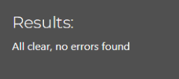
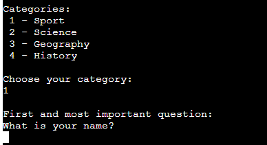
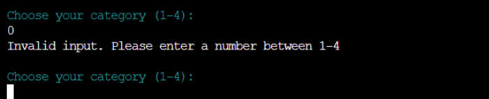
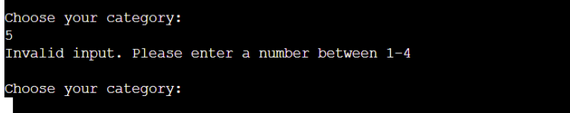
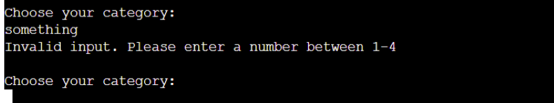
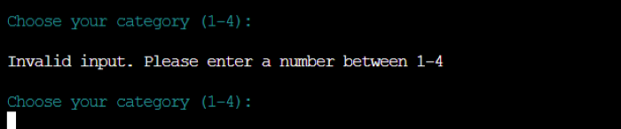
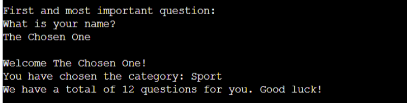
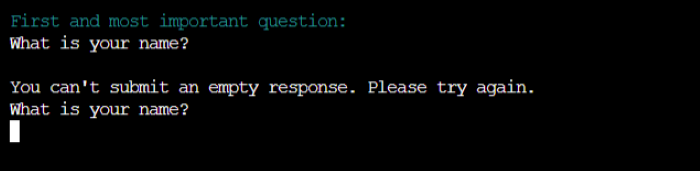
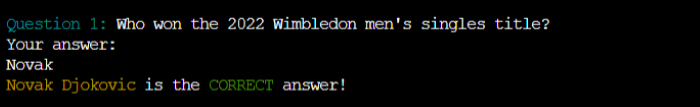
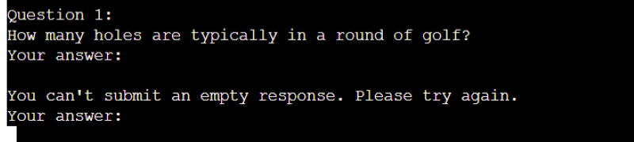

# Testing

> [!NOTE]  
> Return back to the [README.md](README.md) file.

## Code Validation

### Python

⚠️ INSTRUCTIONS ⚠️

The [CI Python Linter](https://pep8ci.herokuapp.com) can be used two different ways.

- Copy/Paste your Python code directly into the linter.
- As an API, using the "raw" URL appended to the linter URL.
    - To find the "raw" URL, navigate to your file directly on the GitHub repo.
    - On that page, GitHub provides a button on the right called "Raw" that you can click.
    - From that new page, copy the full URL, and paste it after the CI Python Linter URL (with a `/` separator).

It's recommended to validate each file using the API URL. This will give you a custom URL which you can use on your testing documentation. It makes it easier to return back to a file for validating it again in the future. Use the steps above to generate your own custom URLs for each Python file.

**IMPORTANT**: `E501 line too long` errors

You must strive to fix all Python lines that are too long (>80 characters). In rare cases where you cannot break the lines [*without breaking the functionality*], adding "`  # noqa`" (*NO Quality Assurance*) to the end of those lines will ignore linting validation. Do not use "`  # noqa`" all over your project just to clear down validation errors! This can still cause a project to fail, for failing to fix actual PEP8 validation errors.

Sometimes variables can get too long, or excessive `if/else` conditional statements. These are acceptable instances to use the "`  # noqa`" comment.

When trying to fix "line too long" errors, try to avoid using `/` to split lines. A better approach would be to use any type of opening bracket, and hit `<Enter>` just after that. Any opening bracket type will work: `(`, `[`, `{`. By using an opening bracket, Python knows where to appropriately indent the next line of code, without having to *guess* for yourself and attempt to "tab" to the correct indentation level.

⚠️ --- END --- ⚠️

I have used the recommended [PEP8 CI Python Linter](https://pep8ci.herokuapp.com) to validate all of my Python files.

| Directory | File | URL | Screenshot | Notes |
| --- | --- | --- | --- | --- |
|  | [run.py](https://github.com/Gary-Burke/quizmaster/blob/main/run.py) | [PEP8 CI Link](https://pep8ci.herokuapp.com/https://raw.githubusercontent.com/Gary-Burke/quizmaster/main/run.py) |  | ⚠️ Notes (if applicable) |

## Defensive Programming

Defensive programming was manually tested with the below user acceptance testing:

| Feature | Expectation | Test | Result | Screenshot |
| --- | --- | --- | --- | --- |
| Category Selection | Feature is expected to allow users to input the corresponding number of the category they would like to play. | Entered a valid selection. | Program moves to next step. |  |
| Data Validation Category| Feature is expected to catch any number below 1. | Entered an invalid selection e.g. 0. | Program catches invalid input and informs user. |  |
| Data Validation Category| Feature is expected to catch any number above 4. | Entered an invalid selection e.g. 5. | Program catches invalid input and informs user. |  |
| Data Validation Category| Feature is expected to catch any input that is not an integer. | Entered an invalid selection e.g. string. | Program catches invalid input and informs user. |  |
| Data Validation Category| Feature is expected to catch any empty input. | Entered an empty input. | Program catches invalid input and informs user. |  |
| Input Name | Feature is expected to let user add his name. | Entered a valid name e.g. string. | Program moves to next step. |  |
| Data Validation Name | Feature is expected to catch any empty input. | Entered an empty input. | Program catches invalid input and informs user. |  |
| Input Answer | Feature is expected to let user add his answer. | Entered a valid answer e.g. string. | Program moves to next step. |  |
| Data Validation Answer | Feature is expected to catch any empty input. | Entered an empty input. | Program catches invalid input and informs user. |  |

> [!NOTE]  
> As a player may use a pseudonym as a name and as answers might consist out of numbers, both of these inputs allow numbers as valid data.

## User Story Testing

⚠️ INSTRUCTIONS ⚠️

Testing User Stories is actually quite simple, once you've already got the stories defined on your README.

Most of your project's **Features** should already align with the **User Stories**, so this should be as simple as creating a table with the User Story, matching with the re-used screenshot from the respective Feature.

⚠️ --- END --- ⚠️

| Target | Expectation | Outcome | Screenshot |
| --- | --- | --- | --- |
| As a user | I would like to input the number of each sandwich type sold during the day | so that I can track daily sales accurately. |  |
| As a user | I would like to view a breakdown of total sandwich sales by type | so that I can easily see which sandwiches are the most and least popular. |  |
| As a user | I would like the application to calculate the total sandwiches sold for the day | so that I don’t have to do manual sums. |  |
| As a user | I would like to see a trend of sandwich sales over time (e.g., week, month) | so that I can identify which sandwiches are consistently popular. |  |
| As a user | I would like the application to suggest an estimated number of each sandwich type to make for the next day, based on past sales data | so that I can minimize waste and shortages. |  |
| As a user | I would like the app to categorize sandwiches by type (e.g., vegetarian, meat, cheese) | so that I can track popularity within different dietary categories. |  |
| As a user | I would like to input sales quickly with minimal typing | so that I can focus on running the shop instead of logging data. |  |
| As a user | I would like the app to be intuitive and easy to use | so that I can start tracking sales without needing extensive training. |  |

## Bugs

⚠️ INSTRUCTIONS ⚠️

Nobody likes bugs,... except the assessors! Projects seem more suspicious if a student doesn't properly track their bugs. If you're about to submit your project without any bugs listed below, you should ask yourself why you're doing this course in the first place, if you're able to build this entire application without running into any bugs. The best thing you can do for any project is to document your bugs! Not only does it show the true stages of development, but think of it as breadcrumbs for yourself in the future, should you encounter the same/similar bug again, it acts as a gentle reminder on what you did to fix the bug.

If/when you encounter bugs during the development stages of your project, you should document them here, ideally with a screenshot explaining what the issue was, and what you did to fix the bug.

Alternatively, an improved way to manage bugs is to use the built-in **[Issues](https://www.github.com/Gary-Burke/quizmaster/issues)** tracker on your GitHub repository. This can be found at the top of your repository, the tab called "Issues".

If using the Issues tracker for bug management, you can simplify the documentation process for testing. Issues allow you to directly paste screenshots into the issue page without having to first save the screenshot locally. You can add labels to your issues (e.g. `bug`), assign yourself as the owner, and add comments/updates as you progress with fixing the issue(s). Once you've solved the issue/bug, you should then "Close" it.

When showcasing your bug tracking for assessment, you can use the following examples below.

⚠️ --- END --- ⚠️

### Fixed Bugs

I've used [GitHub Issues](https://www.github.com/Gary-Burke/quizmaster/issues) to track and manage bugs and issues during the development stages of my project.

All previously closed/fixed bugs can be tracked [here](https://www.github.com/Gary-Burke/quizmaster/issues?q=is%3Aissue+is%3Aclosed+label%3Abug).

### Unfixed Bugs

⚠️ INSTRUCTIONS ⚠️

You will need to mention any unfixed bugs and why they are not fixed upon submission of your project. This section should include shortcomings of the frameworks or technologies used. Although time can be a big variable to consider, paucity of time and difficulty understanding implementation is not a valid reason to leave bugs unfixed. Where possible, you must fix all outstanding bugs, unless outside of your control.

If you've identified any unfixed bugs, no matter how small, be sure to list them here! It's better to be honest and list them, because if it's not documented and an assessor finds the issue, they need to know whether or not you're aware of them as well, and why you've not corrected/fixed them.

⚠️ --- END --- ⚠️

Any remaining open issues can be tracked [here](https://www.github.com/Gary-Burke/quizmaster/issues?q=is%3Aissue+is%3Aopen+label%3Abug).

### Known Issues

| Issue | Screenshot |
| --- | --- |
| When using a helper `clear()` function, any text above the height of the terminal (24 lines) does not clear, and remains when scrolling up. |  |
| The `colorama` terminal colors are fainter on Heroku when compared to the IDE locally. |  |
| Emojis are cut-off when viewing the application from Firefox. |  |
| The Python terminal doesn't work well with Safari, and sometimes uses cannot type in the application. |  |
| If a user types `CTRL`+`C` in the terminal on the live site, they can manually stop the application and receive and error. |  |

> [!IMPORTANT]  
> There are no remaining bugs that I am aware of, though, even after thorough testing, I cannot rule out the possibility.

