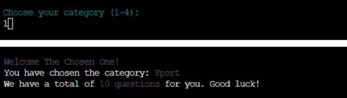
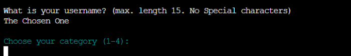
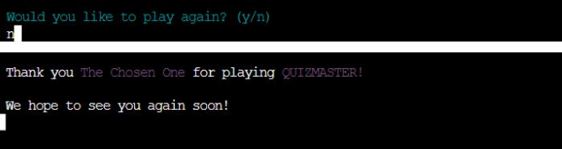
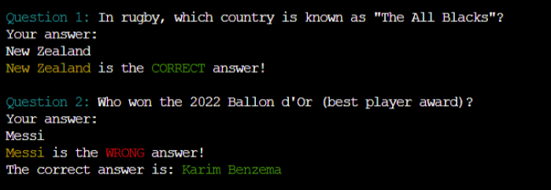

# Testing

> [!NOTE]  
> Return back to the [README.md](README.md) file.

## Code Validation

### Python

I have used the recommended [PEP8 CI Python Linter](https://pep8ci.herokuapp.com) to validate all of my Python files.

| Directory | File | URL | Screenshot | Notes |
| --- | --- | --- | --- | --- |
| root | [run.py](https://github.com/Gary-Burke/quizmaster/blob/main/run.py) | [PEP8 CI Link](https://pep8ci.herokuapp.com/https://raw.githubusercontent.com/Gary-Burke/quizmaster/main/run.py) |  |  |

## Defensive Programming

Defensive programming was manually tested with the below user acceptance testing:

| Feature | Expectation | Test | Result | Screenshot |
| --- | --- | --- | --- | --- |
| Category Selection | Feature is expected to allow users to input the corresponding number of the category they would like to play. | Entered a valid selection. | Program moves to next step. |  |
| Data Validation Category| Feature is expected to catch any number below 1. | Entered an invalid selection e.g. 0. | Program catches invalid input and informs user. |  |
| Data Validation Category| Feature is expected to catch any number above 4. | Entered an invalid selection e.g. 5. | Program catches invalid input and informs user. |  |
| Data Validation Category| Feature is expected to catch any input that is not an integer. | Entered an invalid selection e.g. string. | Program catches invalid input and informs user. |  |
| Data Validation Category| Feature is expected to catch any empty input. | Entered an empty input. | Program catches invalid input and informs user. |  |
| Input Name | Feature is expected to let user add his name. | Entered a valid name e.g. string. | Program moves to next step. |  |
| Data Validation Name | Feature is expected to catch any empty input. | Entered an empty input. | Program catches invalid input and informs user. |  |
| Input Answer | Feature is expected to let user add his answer. | Entered a valid answer e.g. string. | Program moves to next step. |  |
| Data Validation Answer | Feature is expected to catch any empty input. | Entered an empty input. | Program catches invalid input and informs user. |  |
| New Game | Feature is expected to let user choose to play another game. | Entered a valid positive response e.g. "y". | Program starts new game. |  |
| New Game | Feature is expected to let user choose to play another game. | Entered a valid negative response e.g. "n". | Program clears terminal and ends itself. |  |
| Data Validation New Game | Feature is expected to catch any empty input. | Entered an empty input. | Program catches invalid input and informs user. |  |

> [!NOTE]  
> As a player may use a pseudonym as a name and as answers might consist out of numbers, both of these inputs allow numbers as valid data.

## User Story Testing

| Target | Expectation | Outcome | Screenshot |
| --- | --- | --- | --- |
| As a player | it would be good to see a clear and concise landing page | so that I know what the game is about. |  |
| As a player | I want to see the rules clearly seperated from the welcome message | and kept short and direct. |  |
| As a player | it would be exciting if I could choose different categories | with which to play the quiz game. |  |
| As a player | it would be good to know how many questions there are in the selected quiz | so as to know the length of the game. |  |
| As a player | my input needs to be validated and a clear error message needs to be displayed when my input is invalid |  so as to ensure a proper and smooth gaming experience. |  |
| As a player | I want to get feedback on my answers, whether they are right or wrong | and if wrong, I want to know what the actual correct answer is. |  |
| As a player | I would like to be able to submit my name in the game | to get a personalized feedback when the game is over. |  |
| As a player | it would be a good experience to see how many answers I got correct | so that I can challenge myself again next time. |  |
| As a player | I would like to be able to answer a question with a number or with text, e.g. "2" or "Two" | this would add to the user experience. |  |
| As a player | I would like to be able to start another round of the quiz at the end of the game | this would add to the user experience and create a natural flow of events. |  |

## Bugs

### Fixed Bugs

I've used [GitHub Issues](https://www.github.com/Gary-Burke/quizmaster/issues) to track and manage bugs and issues during the development stages of my project.

All previously closed/fixed bugs can be tracked [here](https://www.github.com/Gary-Burke/quizmaster/issues?q=is%3Aissue+is%3Aclosed+label%3Abug).

### Unfixed Bugs

Any remaining open issues can be tracked [here](https://www.github.com/Gary-Burke/quizmaster/issues?q=is%3Aissue+is%3Aopen+label%3Abug).

### Known Issues

| Issue | Screenshot |
| --- | --- |
| The Python terminal doesn't work well with Safari, and sometimes users cannot type in the application. | n/a |
| If a user types `CTRL`+`C` in the terminal on the live site, they can manually stop the application and receive and error. |  |

> [!IMPORTANT]  
> There are no remaining bugs that I am aware of, though, even after thorough testing, I cannot rule out the possibility.

