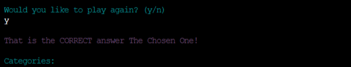
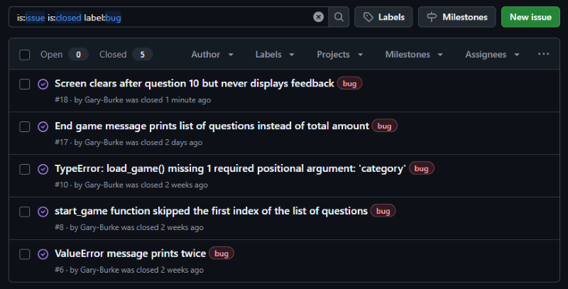

# Testing

> [!NOTE]  
> Return back to the [README.md](README.md) file.

## Code Validation

### Python

I have used the recommended [PEP8 CI Python Linter](https://pep8ci.herokuapp.com) to validate all of my Python files.

| Directory | File | URL | Screenshot | Notes |
| --- | --- | --- | --- | --- |
| root | [run.py](https://github.com/Gary-Burke/quizmaster/blob/main/run.py) | [PEP8 CI Link](https://pep8ci.herokuapp.com/https://raw.githubusercontent.com/Gary-Burke/quizmaster/main/run.py) |  |  |

## Responsiveness

> [!NOTE]  
>The Python terminal was provided to me by Code Institute, and there are known issues with it not being responsive. Since I am limited to using this, these problems and their solutions fall outside of this project's scope. Therefore, I have listed the known issues below without further documentation or screenshots.

- `overflow-x` on mobile devices
- iPhone/Apple devices do not allow users to type anything into the terminal.
- Android devices do work on mobile, but they sometimes decide to stop randomly.
- The project is designed to be responsive from `375px` and upwards. 
- Minor layout inconsistencies may occur on extra-wide (e.g., 4k/8k monitors) or smart-display devices (e.g., Nest Hub, Smart Watches, Gameboy Color, etc.).

## Browser Compatibility

> [!NOTE]  
>The Python terminal was provided to me by Code Institute, and there are known issues with it not being responsive. Since I am limited to using this, these problems and their solutions fall outside of this project's scope. Therefore, I have listed the known issues below without further documentation or screenshots.

- Safari: doesn't work well for any Apple devices except MacBooks

## Lighthouse Audit

> [!NOTE]  
>The Python terminal was provided to me by Code Institute, and there are known issues with it not being responsive. Since I am limited to using this, these problems and their solutions fall outside of this project's scope. Therefore, I have listed the known issues below without further documentation or screenshots.

- Mobile: external render-blocking resources & third-party cookies lower performance and best practices scores.

## Defensive Programming

Defensive programming was manually tested with the following user acceptance testing:

| Feature | Expectation | Test | Result | Screenshot |
| --- | --- | --- | --- | --- |
| Name Input | Feature is expected to let the user add his name. | Entered a valid name, e.g., "The Chosen One". | Program moves to the next step. |  |
| Name Input | Feature is expected to catch any invalid input. | Entered the following: Name > 15 characters. A special character "!". Empty input. | Program catches invalid input and informs the user. |  |
| Category Input | Feature is expected to allow users to input the corresponding number of the category they would like to play. | Entered a valid selection. | Program moves to the next step. |  |
| Category Input| Feature is expected to catch any input that is not an integer or is outside of the category range, e.g., 1-4. | Entered the following: Empty input. String, e.g., "something". Integers outside of range, e.g., "0" and "5". | Program catches invalid input and informs the user. |  |
| Answer Input | Feature is expected to let the user add his answer. | Entered a valid answer, e.g., string. | Program moves to the next step. |  |
| Answer Input | Feature is expected to catch any invalid input. | Entered the following: Empty input. A special character "!". | Program catches invalid input and informs the user. |  |
| New Game Input | Feature is expected to let the user choose to play another game. Any response starting with "y" will be accepted. | Entered a valid positive response, e.g., "y". | Program starts a new game. |  |
| New Game Input | Feature is expected to let the user choose to play another game. Any response starting with "n" will be accepted. | Entered a valid negative response, e.g., "n". | Program clears the terminal, ends the game, and displays a goodbye message afterwards. |  |
| New Game Input | Feature is expected to catch any invalid input. | Entered the following: Empty input. String not starting with "y" or "n", e.g., "ihjuo". A special character "!!!!". | Program catches invalid input and informs the user. |  |

> [!NOTE]  
> Data input validation has been limited to allow alphanumeric characters, underscores, hyphens, spaces, and apostrophes, as these all relate to names and usernames.

## User Story Testing

| Target | Expectation | Outcome | Screenshot |
| --- | --- | --- | --- |
| As a player | it would be good to see a clear and concise landing page | so that I know what the game is about. |  |
| As a player | I want to see the rules clearly separated from the welcome message | and kept short and direct. |  |
| As a player | it would be exciting if I could choose different categories | with which to play the quiz game. |  |
| As a player | it would be good to know how many questions there are in the selected quiz | so as to know the length of the game. |  |
| As a player | my input needs to be validated and a clear error message needs to be displayed when my input is invalid |  so as to ensure a proper and smooth gaming experience. |  |
| As a player | I want to get feedback on my answers, whether they are right or wrong | and if wrong, I want to know what the actual correct answer is. |  |
| As a player | I would like to be able to submit my name in the game | to get personalized feedback when the game is over. |  |
| As a player | it would be a good experience to see how many answers I got correct | so that I can challenge myself again next time. |  |
| As a player | I would like to be able to answer a question with a number or with text, e.g., "2" or "Two" | this would add to the user experience. |  |
| As a player | I would like to be able to start another round of the quiz at the end of the game | this would add to the user experience and create a natural flow of events. |  |

## Bugs

### Fixed Bugs

I've used [GitHub Issues](https://www.github.com/Gary-Burke/quizmaster/issues) to track and manage bugs and issues during the development stages of my project.

All previously closed/fixed bugs can be tracked [here](https://www.github.com/Gary-Burke/quizmaster/issues?q=is%3Aissue+is%3Aclosed+label%3Abug).

### Unfixed Bugs

Any remaining open issues can be tracked [here](https://www.github.com/Gary-Burke/quizmaster/issues?q=is%3Aissue+is%3Aopen+label%3Abug).

### Known Issues

| Issue | Screenshot |
| --- | --- |
| The project is designed to be responsive from `375px` and upwards, in line with the material taught on the course LMS. Minor layout inconsistencies may occur on extra-wide (e.g., 4k/8k monitors), or smart-display devices (e.g., Nest Hub, Smart Watches, Gameboy Color, etc.), as these resolutions are outside the project's scope, as taught by Code Institute. |  |
| The Python terminal doesn't work well with Safari, and sometimes users cannot type in the application. | n/a |
| If a user types `CTRL`+`C` in the terminal on the live site, they can manually stop the application and receive an error. |  |
| The `colorama` terminal colors are fainter on Heroku when compared to the IDE locally. |  |

> [!IMPORTANT]  
> There are no remaining bugs that I am aware of, though, even after thorough testing, I cannot rule out the possibility.

